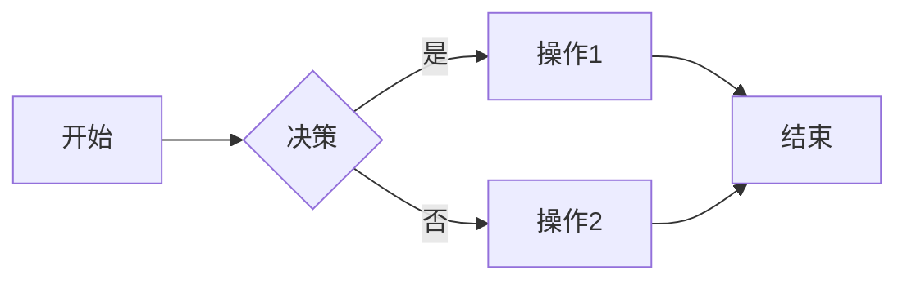
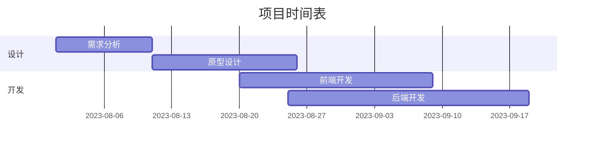
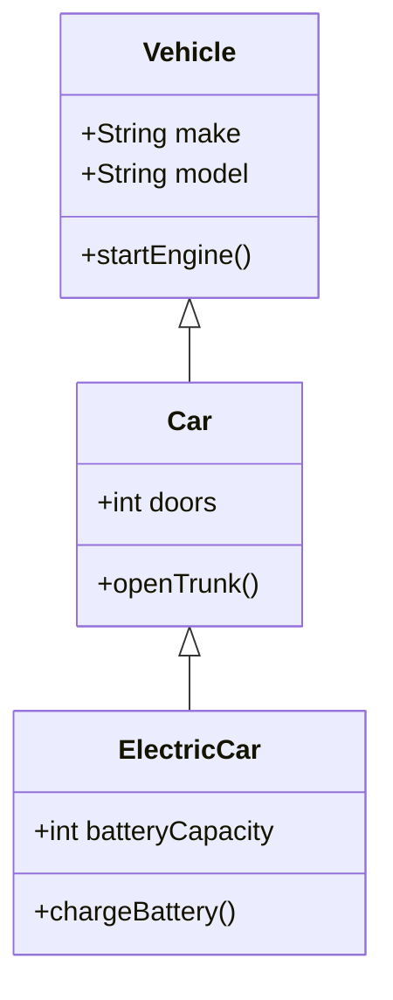
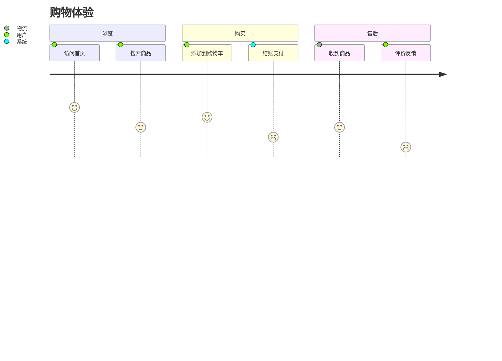

# Markdown 语法大全示例文件

## 一、基础语法

### 1. 标题 (6级)
# H1
## H2
### H3
#### H4
##### H5
###### H6

### 2. 文本样式
*斜体* _斜体_  
**粗体** __粗体__  
***粗斜体***  
~~删除线~~  
`行内代码`  
==高亮== (部分扩展支持)

### 3. 段落与换行
段落之间空一行

行末加两个空格  
实现强制换行

### 4. 分割线
---
***
___

### 5. 引用
> 一级引用
>> 嵌套引用
> - 列表项
> `代码块`

---

## 二、列表

### 1. 无序列表
- Item 1
  - 子项 (缩进2空格)
* 另一种符号
+ 第三种符号

### 2. 有序列表
1. First
2. Second
   1. 子项 (缩进3空格)

### 3. 任务列表 (GitHub扩展)
- [x] 已完成
- [ ] 未完成

---

## 三、链接与图片

### 1. 链接
[内联链接](https://example.com "标题")
[参考链接][id]
<https://自动链接.com>

[id]: https://example.com

### 2. 图片

![参考式图片][logo]

[logo]: https://via.placeholder.com/150

### 3. 锚点 (HTML)
<a name="section1"></a>
## 锚点示例
[跳转到 Section1](#section1)

---

## 四、代码

### 1. 行内代码
使用 `printf()` 函数

### 2. 代码块 (带语法高亮)
```python
# Python 示例
def hello():
    print("Hello, Markdown!")
    return True
```

### 3. 缩进代码块 (4空格或1制表符)
    function test() {
      console.log("缩进代码块示例");
    }

---

## 五、表格

| 左对齐 | 居中对齐 | 右对齐 |
| :----- | :------: | -----: |
| 单元格 |  单元格  |  单元格 |
| **粗体** | `代码` | [链接](/) |
| 长文本示例 | 多行<br>文本 | 数字<br>123 |

---

## 六、扩展语法

### 1. 脚注
这是一句话[^1]
[^1]: 脚注内容

### 2. 定义列表
术语
: 定义内容
: 第二个定义

另一个术语
: 它的定义

### 3. 表情符号 (GitHub)
:smile: :heart: :rocket: :thumbsup:

### 4. 数学公式 (部分解析器支持)
行内公式: $E=mc^2$

块级公式:
$$
\sum_{i=1}^n i = \frac{n(n+1)}{2}
$$

### 5. 图表 (Mermaid)


### 6. 流程图
```flow
st=>start: 开始
op=>operation: 操作
cond=>condition: 条件?
e=>end: 结束

st->op->cond
cond(yes)->e
cond(no)->op
```

---

## 七、HTML支持

<details>
<summary>点击展开详情</summary>
隐藏的内容在这里显示
</details>

键盘快捷键：<kbd>Ctrl</kbd>+<kbd>C</kbd> 复制

<div style="border:1px solid #ccc; padding:10px; margin:10px 0;">
HTML 容器示例
</div>

---

## 八、转义字符

\* 不是斜体 \*  
\[ \] \( \) \# \+ \- \. \! \| \_ \~ \`

---

## 完整示例组合

### 项目计划表



### 类图示例


### 用户旅程


---

> 提示：实际使用时请根据平台支持情况选择合适的语法  
> Markdown 编辑器推荐：[VS Code](https://code.visualstudio.com/) + [Markdown All in One](https://marketplace.visualstudio.com/items?itemName=yzhang.markdown-all-in-one) 扩展  
> 在线编辑器：[StackEdit](https://stackedit.io/), [Dillinger](https://dillinger.io/)


## 使用说明

1. 将以上内容复制到文本编辑器中
2. 保存为 `markdown-cheatsheet.md` 文件
3. 使用支持 Markdown 的编辑器/查看器打开：
   - VS Code（安装 Markdown 预览插件）
   - Typora
   - GitHub/GitLab
   - Obsidian
   - MarkText

## 注意事项

1. 部分语法（如 Mermaid 图表、数学公式）需要特定环境支持
2. 不同平台对 Markdown 的扩展支持可能不同
3. 实际渲染效果可能因解析器而异
4. 建议使用 [Markdown 预览工具](https://markdownlivepreview.com/) 测试效果

> 本文件包含所有主流 Markdown 语法元素，可作为参考手册使用