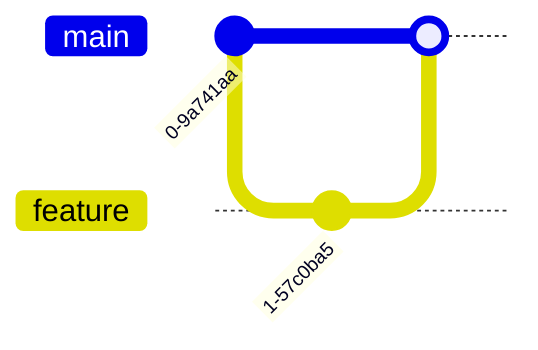

# markdown画图工具mermaid使用指南
在vscode中安装Markdown Preview Mermaid Support插件后，可以预览mermaid语法画图
Mermaid 是一个强大的基于文本的图表生成工具，支持多种图表类型。以下是主要图表类型的语法概览和示例：

---

### **1. 流程图 (Flowchart)**
**语法：**


**方向：**
- `TD`：从上到下（Top-Down）
- `LR`：从左到右（Left-Right）
- `BT`：从下到上
- `RL`：从右到左

---

### **2. 时序图 (Sequence Diagram)**
**语法：**


**箭头类型：**
- `->>`：实线箭头
- `-->>`：虚线箭头
- `->` 或 `-->`：无箭头线

---

### **3. 类图 (Class Diagram)**
**语法：**


**关系符号：**
- `<|--`：继承
- `*--`：组合
- `o--`：聚合
- `-->`：关联

---

### **4. 状态图 (State Diagram)**
**语法：**


---

### **5. 实体关系图 (ER Diagram)**
**语法：**


---

### **6. 用户旅程图 (User Journey)**
**语法：**


---

### **7. 甘特图 (Gantt Chart)**
**语法：**


---

### **8. 饼图 (Pie Chart)**
**语法：**


---

### **9. 需求图 (Requirement Diagram)**
**语法：**
```mermaid
requirementDiagram
    requirement 功能需求 {
        id: REQ_001
        text: "用户必须能登录"
    }
```

---

### **10. Git 图 (Git Graph)**
**语法：**


---

### **11. 思维导图 (Mindmap)**
**语法：**


---

### **注意事项：**
1. **渲染环境**：确保你的 Markdown 编辑器/平台支持 Mermaid（如 VS Code + 插件、GitLab、Obsidian 等）。
2. **注释**：用 `%%` 添加注释（例如：`%% 这是注释`）。
3. **样式调整**：可通过 CSS 类自定义样式：
   ```mermaid
   graph TD
       A[Start]:::red --> B{Decision}
       classDef red fill:#f00,color:#fff;
   ```

---

官方文档参考：[Mermaid Live Editor](https://mermaid.live/)  
建议直接实践调试，实时预览效果！